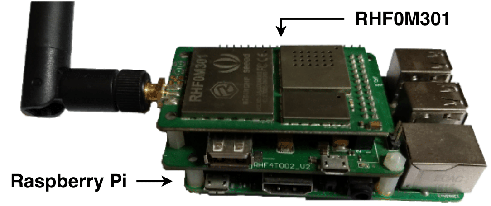

# RHF0M301-Chirpstack
Step by step to install and configure RHF0M301 LoRaWAN gateway for Chirpstack LoRaWAN Server using regional parameter AU915.

## Requirements
1. Install [Raspberry Pi OS](https://www.raspberrypi.org/software/).
2. Install [Chirpstack Gateway Bridge](https://www.chirpstack.io/gateway-bridge/install/debian/).
3. Clone [LoRa Gateway repository](https://github.com/Lora-net/lora_gateway) and follow the instructions in README.
4. Do the same as before for [LoRa Packet Forwarder](https://github.com/Lora-net/packet_forwarder).
5. Follow the [documentation](https://www.chirpstack.io/project/guides/connect-gateway/) to connect a gateway.
6. Replace **global_conf.json** in LoRa Packet Forwader directory and update with your RPi3 MAC address.
7. Run **activate.sh** to initialize RHF0M301 hardware and start the packet forwarder.
